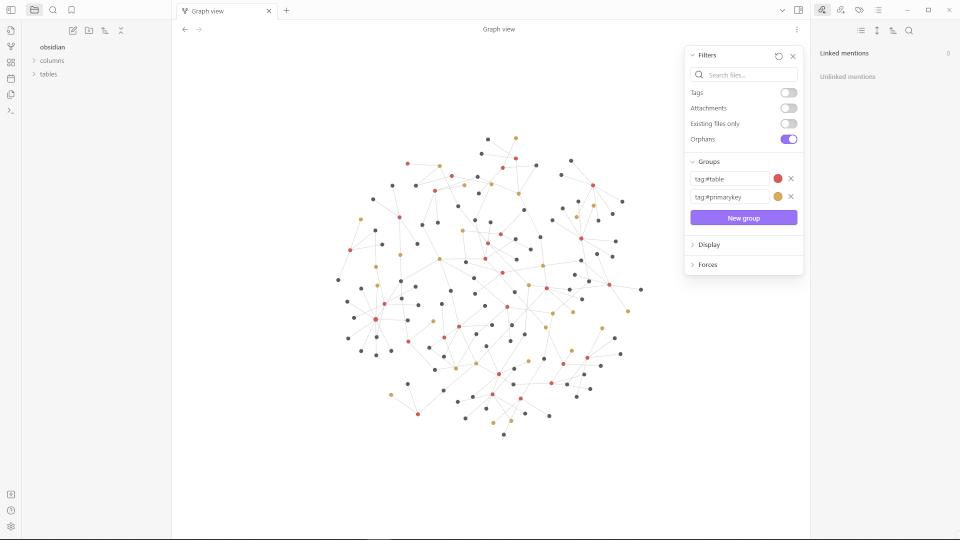

# SQLtoObsidianNote
 Creates Obsidian Note Markdown Files from SQL Schema

<a href="readmeimgs/graph.png"></a>

## Description
SQLtoObsidianNote parses SQL using [sqlglot](https://github.com/tobymao/sqlglot) and formats the result in [Obsidian-flavored](https://obsidian.md/) Markdown Format. It is intended for use on full Database Schemas in order to generate baseline documention. The following format is currently implemented (run `sample.py` for a more specific example):

### Tables
**File name:** `{tablename}.md`
```
#sql #table

### Columns:
{Backlinks to Columns}

### Constraints:
{Bulleted List of Table Constraints, except Table Constraints applied to a single Column}

### SQL
\`\`\`
{SQL generated by sqlglot}
\`\`\`
```

### Columns
**File name:** `{tablename}-{columnname}.md`
```
#sql #column {as applicable: #primarykey|#autoincrement|#notnull|#hasdefault|#isunique|#hascheck}

### Name:
{columnname}
### Type:
{columntype}

### Constraints:
{Bulleted List of Column Constraints, except Constraints that include other Columns within the same table}
```

## Installation
Clone the repository and install with pip, e.g.- `pip install .`

## Usage
The module has a commandline interface accessible via either the command `sqltonote` or `python -m SQLtoObsidianNote`. The cli takes a filename as a required input and produces two directories: `tables` and `columns` which contain formatted Markdown documents for the parsed Schema. These directories can then be moved into an Obsidian Vault (not necessary if vault's location is supplied as the output directory).
```
python -m SQLtoObsidianNote --help
usage: SQLtoObsidianNote [-h] [--output OUTPUT] [--dialect DIALECT] input

Convert SQL to Obsidian notes

positional arguments:
  input              The input SQL file

options:
  -h, --help         show this help message and exit
  --output OUTPUT    The output directory
  --dialect DIALECT  The SQL dialect to use
```

Lower-level usage involves `SQLtoObsidianNote.parse_sql(inputstring, dialect = dialect)` which returns a list of `TablePage` objects. While no official documentation has been generated the package is fully typed and the codebase is very small so it's a quick read.

## Missing Features
There are a number of features I haven't needed to implement yet, such as Common Table Expressions or Views. If I haven't implemented a Feature you need feel free to either open an Issue or submit a PR.